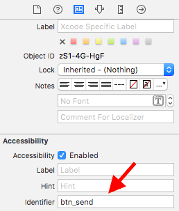
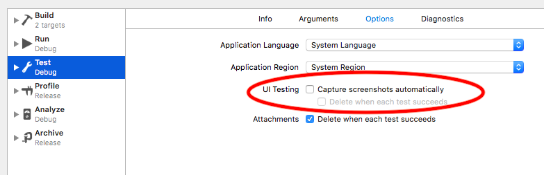
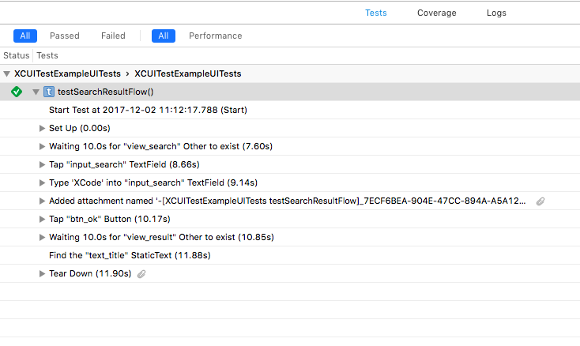

# XCUITestExample
Tests more readable with Page Objects and Method Chaining :
```
func testSearchResultFlow() {
  SearchPage()
      .type(query: "XCode") { self.takeScreenShot() }
      .tapOk()
      .getTitle {
          XCTAssertEqual("Result for XCode", $0)
      }
}
```

Every Page subclass must override the rootElement
```
class ResultPage: Page {
  override var rootElement: XCUIElement {
    return app.otherElements["view_result"]
  }
```


Use Accessibility Identifiers instead of elements' values

`app.buttons["btn_send"].tap()`




Disable automatic screenshots.



Log your tests properly to make a better report.


